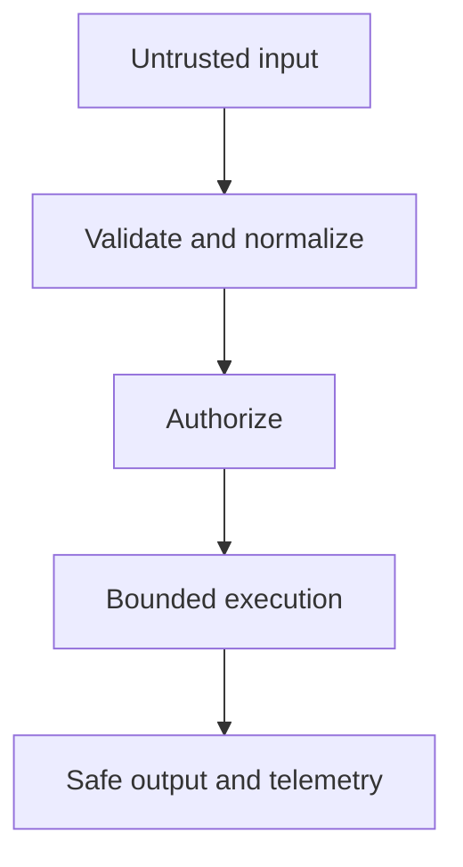

# Security

---

## Platform · Security

> **Platform concern** — Turn security from a checklist into a set of enforced boundaries with observable failure.

Defensive defaults for input, secrets, cookies, authorization, limits, and incident response.

### Key concepts

<Columns cols={3}>
  <Card title="Input" icon="sparkles">
    Untrusted
  </Card>
  <Card title="Secret" icon="shield-check">
    Sensitive
  </Card>
  <Card title="Error" icon="gauge-high">
    Observable
  </Card>
</Columns>

### Operating model

### Decisions to make before production

| Decision | Recommended posture | Failure it prevents |
| --- | --- | --- |
| Input | Untrusted | Parse, validate, constrain. |
| Secret | Sensitive | Inject, redact, rotate. |
| Error | Observable | Correlate without disclosure. |

<Note>
Threat modeling is most effective when attached to a concrete request, data flow, or deployment change.
</Note>

### Boundary and failure behavior

Security posture is the combined effect of every route, adapter, default, and operational shortcut.

### Questions for review

| Question | Answer to document |
| --- | --- |
| What is a dangerous default? | A permissive origin, unlimited body, verbose error, or implicit authorization. |
| What should be redacted? | Credentials, tokens, session data, personal data, and provider secrets. |
| What does readiness mean? | The service can safely receive traffic, not merely that the process is alive. |

### Implementation notes

| Engineering move | Guidance |
| --- | --- |
| **List trust zones** | Mark browser, network, process, database, provider, and operator boundaries. |
| **Fail closed** | Require explicit authorization and reject ambiguous input. |
| **Limit resources** | Bound bodies, concurrency, streams, cache entries, and retries. |
| **Prepare response** | Keep secrets out of logs and define an incident investigation path. |

### Decision lens

| Mode | Practical emphasis |
| --- | --- |
| **Application** | Validation, authorization, output encoding, and error policy. |
| **Infrastructure** | TLS, network controls, secret manager, and runtime isolation. |
| **Operations** | Alerts, access review, rotation, and incident runbooks. |

## Related topics

<Columns cols={3}>
- [user-lock · **Secure sessions**](/platform/auth) — Read the focused guide for this boundary.
- [globe · **Harden HTTP**](/reference/http-contracts) — Read the focused guide for this boundary.
- [server-stack · **Run securely**](/operations/production) — Read the focused guide for this boundary.
</Columns>

## References

[1]: https://github.com/jeffersoncampos12p-dev/jeston "Jeston source repository"
[2]: https://www.npmjs.com/package/@hedronjs/jeston "Jeston package on npm"
[3]: https://nodejs.org/api/http.html "Node.js HTTP API"
[4]: https://developer.mozilla.org/en-US/docs/Web/API/AbortSignal "AbortSignal Web API"
[5]: https://react.dev/reference/react-dom/server "React server rendering APIs"
[6]: https://www.typescriptlang.org/docs/handbook/intro.html "TypeScript handbook"
