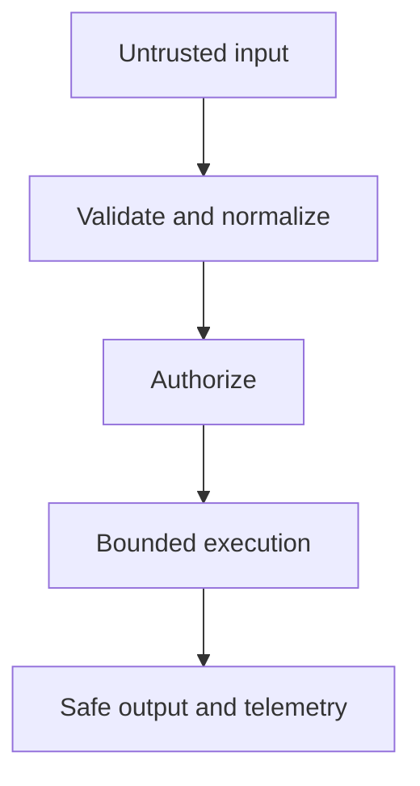

# Security

<Accordion title="Detailed background for this page" icon="book-open" defaultOpen={true}>

Turn security from a checklist into a set of enforced boundaries with observable failure.

**Expected outcome.** Defensive defaults for input, secrets, cookies, authorization, limits, and incident response.

**Why this boundary matters.** Security posture is the combined effect of every route, adapter, default, and operational shortcut.

### Page-specific implementation notes

- **List trust zones:** Mark browser, network, process, database, provider, and operator boundaries.
- **Fail closed:** Require explicit authorization and reject ambiguous input.
- **Limit resources:** Bound bodies, concurrency, streams, cache entries, and retries.
- **Prepare response:** Keep secrets out of logs and define an incident investigation path.

### Page-specific failure questions

- **What is a dangerous default?:** A permissive origin, unlimited body, verbose error, or implicit authorization.
- **What should be redacted?:** Credentials, tokens, session data, personal data, and provider secrets.
- **What does readiness mean?:** The service can safely receive traffic, not merely that the process is alive.

</Accordion>

---

## Platform · Security

> **Page focus** — Turn security from a checklist into a set of enforced boundaries with observable failure.

<Columns cols={2}>
  <Card title="What you will leave with" icon="shield-halved" type="check">
    Defensive defaults for input, secrets, cookies, authorization, limits, and incident response.
  </Card>

  <Card title="Why this deserves its own page" icon="circle-question" type="note">
    Security posture is the combined effect of every route, adapter, default, and operational shortcut.
  </Card>
</Columns>

### System view

<Info>
This guide has its own decision surface. Use the visual blocks for orientation, then open the detailed background above when you need the longer explanation.
</Info>

---

## Implementation sequence

<Steps titleSize="h3">
  <Step title="List trust zones" icon="crosshairs">
    Mark browser, network, process, database, provider, and operator boundaries.
  </Step>
  <Step title="Fail closed" icon="layers-3">
    Require explicit authorization and reject ambiguous input.
  </Step>
  <Step title="Limit resources" icon="triangle-exclamation">
    Bound bodies, concurrency, streams, cache entries, and retries.
  </Step>
  <Step title="Prepare response" icon="flask-conical">
    Keep secrets out of logs and define an incident investigation path.
  </Step>
</Steps>

## Choose a working mode

<Tabs>
  <Tab title="Application" icon="book-open">
    Validation, authorization, output encoding, and error policy.
  </Tab>
  <Tab title="Infrastructure" icon="hammer">
    TLS, network controls, secret manager, and runtime isolation.
  </Tab>
  <Tab title="Operations" icon="chart-line">
    Alerts, access review, rotation, and incident runbooks.
  </Tab>
</Tabs>

---

## Decision table

| Concern | Default posture | Review question |
| --- | --- | --- |
| Input | Untrusted | Parse, validate, constrain. |
| Secret | Sensitive | Inject, redact, rotate. |
| Error | Observable | Correlate without disclosure. |

> **Design note**
>
> Secure defaults are useful because the unsafe path should require deliberate action.

<Note>
Threat modeling is most effective when attached to a concrete request, data flow, or deployment change.
</Note>

## Questions worth answering

<AccordionGroup>
  <Accordion title="What is a dangerous default?" icon="circle-question">
    A permissive origin, unlimited body, verbose error, or implicit authorization.
  </Accordion>
  <Accordion title="What should be redacted?" icon="binoculars">
    Credentials, tokens, session data, personal data, and provider secrets.
  </Accordion>
  <Accordion title="What does readiness mean?" icon="arrow-right">
    The service can safely receive traffic, not merely that the process is alive.
  </Accordion>
</AccordionGroup>

---

## Continue with a related guide

<Columns cols={3}>
  <Card title="Secure sessions" icon="user-lock" href="/platform/auth" horizontal>Open the related guide when this page leaves a boundary unresolved.</Card>
  <Card title="Harden HTTP" icon="globe" href="/reference/http-contracts" horizontal>Open the related guide when this page leaves a boundary unresolved.</Card>
  <Card title="Run securely" icon="server-stack" href="/operations/production" horizontal>Open the related guide when this page leaves a boundary unresolved.</Card>
</Columns>

<Check>
This page is complete when its specific decision is documented, its failure behavior is tested, and its operational signal has an owner.
</Check>

## References

[1]: https://github.com/jeffersoncampos12p-dev/jeston "Jeston source repository"
[2]: https://www.npmjs.com/package/@hedronjs/jeston "Jeston package on npm"
[3]: https://nodejs.org/api/http.html "Node.js HTTP API"
[4]: https://developer.mozilla.org/en-US/docs/Web/API/AbortSignal "AbortSignal Web API"
[5]: https://react.dev/reference/react-dom/server "React server rendering APIs"
[6]: https://www.typescriptlang.org/docs/handbook/intro.html "TypeScript handbook"
