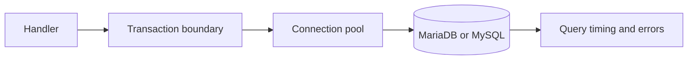

# SQL and databases

<Accordion title="Detailed background for this page" icon="book-open">

Make persistence predictable under concurrency, retries, migrations, and partial failure.

**Expected outcome.** A query boundary with transaction ownership, pool limits, migration discipline, and safe errors.

**Why this boundary matters.** Database behavior dominates many heavy workloads; correctness and saturation matter before query micro-optimizations.

### Page-specific implementation notes

- **Define the unit of work:** Decide which writes commit together and which can be asynchronous.
- **Parameterize queries:** Keep values separate from SQL text and validate sort or filter choices.
- **Bound the pool:** Match concurrency to database capacity, not to request volume.
- **Plan migrations:** Use expand, migrate, contract when old and new code overlap.

### Page-specific failure questions

- **What belongs in a transaction?:** State changes that must share one commit decision.
- **What should be retried?:** Transient, idempotent operations with clear transaction semantics.
- **How should pool pressure appear?:** As a metric and alert before requests fail en masse.

</Accordion>

---

## Platform · SQL

> **Page focus** — Make persistence predictable under concurrency, retries, migrations, and partial failure.

### At a glance

| Scope | Practical result |
| --- | --- |
| **Focus** | Make persistence predictable under concurrency, retries, migrations, and partial failure. |
| **Deliverable** | A query boundary with transaction ownership, pool limits, migration discipline, and safe errors. |
| **Reason to care** | Database behavior dominates many heavy workloads; correctness and saturation matter before query micro-optimizations. |

<Info>
This page is intentionally focused on one boundary. Use the decision table and implementation sequence below as a working review sheet, not as a generic framework overview.
</Info>

### System view

<Info>
This guide has its own decision surface. Use the visual blocks for orientation, then open the detailed background above when you need the longer explanation.
</Info>

---

## Implementation sequence

<Steps titleSize="h3">
  <Step title="Define the unit of work" icon="crosshairs">
    Decide which writes commit together and which can be asynchronous.
  </Step>
  <Step title="Parameterize queries" icon="layers-3">
    Keep values separate from SQL text and validate sort or filter choices.
  </Step>
  <Step title="Bound the pool" icon="triangle-exclamation">
    Match concurrency to database capacity, not to request volume.
  </Step>
  <Step title="Plan migrations" icon="flask-conical">
    Use expand, migrate, contract when old and new code overlap.
  </Step>
</Steps>

## Choose a working mode

<Tabs>
  <Tab title="Read path" icon="book-open">
    Index for real predicates and measure result size.
  </Tab>
  <Tab title="Write path" icon="hammer">
    Use transactions and idempotency for repeated delivery.
  </Tab>
  <Tab title="Migration" icon="chart-line">
    Keep compatibility during rolling deploys and backfills.
  </Tab>
</Tabs>

---

## Decision table

| Concern | Default posture | Review question |
| --- | --- | --- |
| Pool | Finite connections | Protect the database from application concurrency. |
| Transaction | Atomic unit | Make partial writes impossible where required. |
| Migration | Compatible step | Allow old and new versions to coexist. |

> **Design note**
>
> A database abstraction is successful when it makes unsafe concurrency difficult to express.

<Note>
Never put unbounded result sets, dynamic identifiers, or secret-bearing SQL errors into a public response.
</Note>

## Questions worth answering

<AccordionGroup>
  <Accordion title="What belongs in a transaction?" icon="circle-question">
    State changes that must share one commit decision.
  </Accordion>
  <Accordion title="What should be retried?" icon="binoculars">
    Transient, idempotent operations with clear transaction semantics.
  </Accordion>
  <Accordion title="How should pool pressure appear?" icon="arrow-right">
    As a metric and alert before requests fail en masse.
  </Accordion>
</AccordionGroup>

---

## Continue with a related guide

<Columns cols={3}>
  <Card title="Add cache and jobs" icon="layer-group" href="/platform/cache-jobs-storage" horizontal>Open the related guide when this page leaves a boundary unresolved.</Card>
  <Card title="Evolve schemas" icon="arrows-rotate" href="/operations/migrations" horizontal>Open the related guide when this page leaves a boundary unresolved.</Card>
  <Card title="Measure persistence" icon="gauge-high" href="/operations/benchmark" horizontal>Open the related guide when this page leaves a boundary unresolved.</Card>
</Columns>

<Check>
This page is complete when its specific decision is documented, its failure behavior is tested, and its operational signal has an owner.
</Check>

## References

[1]: https://github.com/jeffersoncampos12p-dev/jeston "Jeston source repository"
[2]: https://www.npmjs.com/package/@hedronjs/jeston "Jeston package on npm"
[3]: https://nodejs.org/api/http.html "Node.js HTTP API"
[4]: https://developer.mozilla.org/en-US/docs/Web/API/AbortSignal "AbortSignal Web API"
[5]: https://react.dev/reference/react-dom/server "React server rendering APIs"
[6]: https://www.typescriptlang.org/docs/handbook/intro.html "TypeScript handbook"
