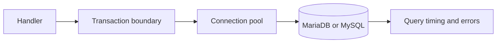

# SQL and databases

---

## Platform · SQL

> **Platform concern** — Make persistence predictable under concurrency, retries, migrations, and partial failure.

A query boundary with transaction ownership, pool limits, migration discipline, and safe errors.

### Operating model

### Decisions to make before production

| Decision | Recommended posture | Failure it prevents |
| --- | --- | --- |
| Pool | Finite connections | Protect the database from application concurrency. |
| Transaction | Atomic unit | Make partial writes impossible where required. |
| Migration | Compatible step | Allow old and new versions to coexist. |

### Boundary and failure behavior

Database behavior dominates many heavy workloads; correctness and saturation matter before query micro-optimizations.

### Questions for review

| Question | Answer to document |
| --- | --- |
| What belongs in a transaction? | State changes that must share one commit decision. |
| What should be retried? | Transient, idempotent operations with clear transaction semantics. |
| How should pool pressure appear? | As a metric and alert before requests fail en masse. |

## Related material

<Columns cols={3}>
  <Card title="Add cache and jobs" icon="layer-group" href="/platform/cache-jobs-storage" horizontal>Read the focused guide for this boundary.</Card>
  <Card title="Evolve schemas" icon="arrows-rotate" href="/operations/migrations" horizontal>Read the focused guide for this boundary.</Card>
  <Card title="Measure persistence" icon="gauge-high" href="/operations/benchmark" horizontal>Read the focused guide for this boundary.</Card>
</Columns>

## References

[1]: https://github.com/jeffersoncampos12p-dev/jeston "Jeston source repository"
[2]: https://www.npmjs.com/package/@hedronjs/jeston "Jeston package on npm"
[3]: https://nodejs.org/api/http.html "Node.js HTTP API"
[4]: https://developer.mozilla.org/en-US/docs/Web/API/AbortSignal "AbortSignal Web API"
[5]: https://react.dev/reference/react-dom/server "React server rendering APIs"
[6]: https://www.typescriptlang.org/docs/handbook/intro.html "TypeScript handbook"
