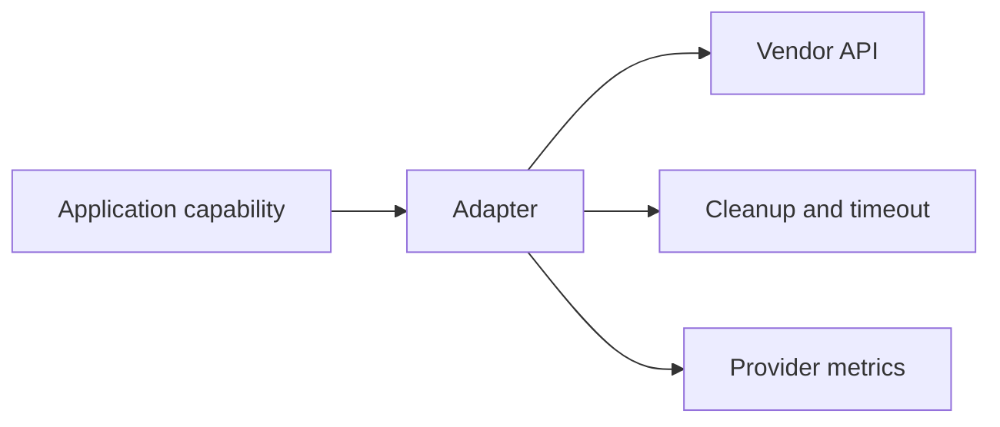

# Adapters

<Accordion title="Detailed background for this page" icon="book-open" defaultOpen={true}>

Create provider seams that preserve framework lifecycle while isolating vendor protocol and credentials.

**Expected outcome.** Adapters with narrow capabilities, explicit cleanup, and replaceable test doubles.

**Why this boundary matters.** An adapter is valuable when it makes provider choice reversible without weakening the application contract.

### Page-specific implementation notes

- **Name the capability:** Describe what the application needs, not what one vendor happens to call it.
- **Define lifecycle:** Specify initialization, timeout, cancellation, close, and health behavior.
- **Map errors:** Translate provider failures into stable application categories.
- **Prove replacement:** Use a fake or second implementation to test the seam.

### Page-specific failure questions

- **When is an abstraction premature?:** Before a real second implementation or a clear replacement requirement exists.
- **What should a fake simulate?:** Latency, cancellation, transient failure, permanent failure, and result shape.
- **Who owns credentials?:** The adapter boundary or platform secret manager, never route code.

</Accordion>

---

## Reference · Adapters

> **Page focus** — Create provider seams that preserve framework lifecycle while isolating vendor protocol and credentials.

<Columns cols={2}>
  <Card title="What you will leave with" icon="puzzle-piece" type="check">
    Adapters with narrow capabilities, explicit cleanup, and replaceable test doubles.
  </Card>

  <Card title="Why this deserves its own page" icon="circle-question" type="note">
    An adapter is valuable when it makes provider choice reversible without weakening the application contract.
  </Card>
</Columns>

### System view

<Info>
This guide has its own decision surface. Use the visual blocks for orientation, then open the detailed background above when you need the longer explanation.
</Info>

---

## Implementation sequence

<Steps titleSize="h3">
  <Step title="Name the capability" icon="crosshairs">
    Describe what the application needs, not what one vendor happens to call it.
  </Step>
  <Step title="Define lifecycle" icon="layers-3">
    Specify initialization, timeout, cancellation, close, and health behavior.
  </Step>
  <Step title="Map errors" icon="triangle-exclamation">
    Translate provider failures into stable application categories.
  </Step>
  <Step title="Prove replacement" icon="flask-conical">
    Use a fake or second implementation to test the seam.
  </Step>
</Steps>

## Choose a working mode

<Tabs>
  <Tab title="Database" icon="book-open">
    Queries, transactions, pool, and migration ownership.
  </Tab>
  <Tab title="Model" icon="hammer">
    Generation, streaming, usage, and safety policy.
  </Tab>
  <Tab title="Storage" icon="chart-line">
    Upload, read, retention, authorization, and deletion.
  </Tab>
</Tabs>

---

## Decision table

| Concern | Default posture | Review question |
| --- | --- | --- |
| Capability | Small interface | Avoid vendor-shaped application code. |
| Lifecycle | Open and close | Prevent leaked handles. |
| Failure | Translated category | Keep provider detail observable but not contagious. |

> **Design note**
>
> The best adapter is boring at the call site and precise at the boundary.

<Note>
Do not hide domain authorization or business retries in an infrastructure adapter.
</Note>

## Questions worth answering

<AccordionGroup>
  <Accordion title="When is an abstraction premature?" icon="circle-question">
    Before a real second implementation or a clear replacement requirement exists.
  </Accordion>
  <Accordion title="What should a fake simulate?" icon="binoculars">
    Latency, cancellation, transient failure, permanent failure, and result shape.
  </Accordion>
  <Accordion title="Who owns credentials?" icon="arrow-right">
    The adapter boundary or platform secret manager, never route code.
  </Accordion>
</AccordionGroup>

---

## Continue with a related guide

<Columns cols={3}>
  <Card title="Register integrations" icon="plug" href="/reference/integrations" horizontal>Open the related guide when this page leaves a boundary unresolved.</Card>
  <Card title="Apply a database adapter" icon="database" href="/platform/sql" horizontal>Open the related guide when this page leaves a boundary unresolved.</Card>
  <Card title="Review ownership" icon="diagram-project" href="/core/architecture" horizontal>Open the related guide when this page leaves a boundary unresolved.</Card>
</Columns>

<Check>
This page is complete when its specific decision is documented, its failure behavior is tested, and its operational signal has an owner.
</Check>

## References

[1]: https://github.com/jeffersoncampos12p-dev/jeston "Jeston source repository"
[2]: https://www.npmjs.com/package/@hedronjs/jeston "Jeston package on npm"
[3]: https://nodejs.org/api/http.html "Node.js HTTP API"
[4]: https://developer.mozilla.org/en-US/docs/Web/API/AbortSignal "AbortSignal Web API"
[5]: https://react.dev/reference/react-dom/server "React server rendering APIs"
[6]: https://www.typescriptlang.org/docs/handbook/intro.html "TypeScript handbook"
