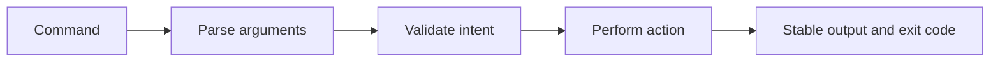

# CLI reference

<Accordion title="Detailed background for this page" icon="book-open">

Use the CLI as a shared vocabulary for creation, verification, local operations, and release work.

**Expected outcome.** Commands that are discoverable, scriptable, and consistent with CI.

**Why this boundary matters.** A CLI becomes infrastructure when teams use it in automation; ambiguous output and hidden side effects then become operational debt.

### Page-specific implementation notes

- **List the command contract:** Define arguments, defaults, files touched, and exit codes.
- **Keep dry runs safe:** Preview migrations, releases, or destructive work where possible.
- **Make output scriptable:** Use stable text or structured output for automation.
- **Run CI parity:** Ensure local checks invoke the same underlying commands as CI.

### Page-specific failure questions

- **What should help include?:** Purpose, examples, defaults, environment, output, and failure cases.
- **When add JSON output?:** When another tool needs reliable fields instead of parsing prose.
- **What belongs in CI?:** Checks that protect package integrity and runtime compatibility.

</Accordion>

---

## Reference · CLI

> **Page focus** — Use the CLI as a shared vocabulary for creation, verification, local operations, and release work.

### At a glance

| Scope | Practical result |
| --- | --- |
| **Focus** | Use the CLI as a shared vocabulary for creation, verification, local operations, and release work. |
| **Deliverable** | Commands that are discoverable, scriptable, and consistent with CI. |
| **Reason to care** | A CLI becomes infrastructure when teams use it in automation; ambiguous output and hidden side effects then become operational debt. |

<Info>
This page is intentionally focused on one boundary. Use the decision table and implementation sequence below as a working review sheet, not as a generic framework overview.
</Info>

### System view

<Info>
This guide has its own decision surface. Use the visual blocks for orientation, then open the detailed background above when you need the longer explanation.
</Info>

---

## Implementation sequence

<Steps titleSize="h3">
  <Step title="List the command contract" icon="crosshairs">
    Define arguments, defaults, files touched, and exit codes.
  </Step>
  <Step title="Keep dry runs safe" icon="layers-3">
    Preview migrations, releases, or destructive work where possible.
  </Step>
  <Step title="Make output scriptable" icon="triangle-exclamation">
    Use stable text or structured output for automation.
  </Step>
  <Step title="Run CI parity" icon="flask-conical">
    Ensure local checks invoke the same underlying commands as CI.
  </Step>
</Steps>

## Choose a working mode

<Tabs>
  <Tab title="Explore" icon="book-open">
    Use help and inspection commands without mutation.
  </Tab>
  <Tab title="Develop" icon="hammer">
    Generate or verify local artifacts.
  </Tab>
  <Tab title="Release" icon="chart-line">
    Run checks, package inspection, and publication gates.
  </Tab>
</Tabs>

---

## Decision table

| Concern | Default posture | Review question |
| --- | --- | --- |
| Exit code | Automation signal | Zero means the contract passed. |
| Output | Human and machine readable | Do not require screen scraping. |
| Mutation | Explicit | Show what will change before acting. |

> **Design note**
>
> A good command leaves less ambiguity than the manual sequence it replaces.

<Note>
Document whether a command is read-only, local-mutating, or externally consequential.
</Note>

## Questions worth answering

<AccordionGroup>
  <Accordion title="What should help include?" icon="circle-question">
    Purpose, examples, defaults, environment, output, and failure cases.
  </Accordion>
  <Accordion title="When add JSON output?" icon="binoculars">
    When another tool needs reliable fields instead of parsing prose.
  </Accordion>
  <Accordion title="What belongs in CI?" icon="arrow-right">
    Checks that protect package integrity and runtime compatibility.
  </Accordion>
</AccordionGroup>

---

## Continue with a related guide

<Columns cols={3}>
  <Card title="Run release gates" icon="circle-check" href="/operations/release-checks" horizontal>Open the related guide when this page leaves a boundary unresolved.</Card>
  <Card title="Create a workspace" icon="download" href="/start/installation" horizontal>Open the related guide when this page leaves a boundary unresolved.</Card>
  <Card title="Understand outputs" icon="code" href="/reference/types" horizontal>Open the related guide when this page leaves a boundary unresolved.</Card>
</Columns>

<Check>
This page is complete when its specific decision is documented, its failure behavior is tested, and its operational signal has an owner.
</Check>

## References

[1]: https://github.com/jeffersoncampos12p-dev/jeston "Jeston source repository"
[2]: https://www.npmjs.com/package/@hedronjs/jeston "Jeston package on npm"
[3]: https://nodejs.org/api/http.html "Node.js HTTP API"
[4]: https://developer.mozilla.org/en-US/docs/Web/API/AbortSignal "AbortSignal Web API"
[5]: https://react.dev/reference/react-dom/server "React server rendering APIs"
[6]: https://www.typescriptlang.org/docs/handbook/intro.html "TypeScript handbook"
