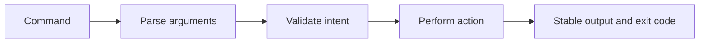

# CLI reference

---

## Reference · CLI

> **Reference purpose** — Use the CLI as a shared vocabulary for creation, verification, local operations, and release work.

Commands that are discoverable, scriptable, and consistent with CI.

### Key concepts

<Columns cols={3}>
  <Card title="Exit code" icon="sparkles">
    Automation signal
  </Card>
  <Card title="Output" icon="shield-check">
    Human and machine readable
  </Card>
  <Card title="Mutation" icon="gauge-high">
    Explicit
  </Card>
</Columns>

### Reference model

### Contract summary

| Property | Definition | Review question |
| --- | --- | --- |
| Exit code | Automation signal | Zero means the contract passed. |
| Output | Human and machine readable | Do not require screen scraping. |
| Mutation | Explicit | Show what will change before acting. |

### Interpretation

A CLI becomes infrastructure when teams use it in automation; ambiguous output and hidden side effects then become operational debt.

> **Reference note**
>
> A good command leaves less ambiguity than the manual sequence it replaces.

### Implementation notes

| Engineering move | Guidance |
| --- | --- |
| **List the command contract** | Define arguments, defaults, files touched, and exit codes. |
| **Keep dry runs safe** | Preview migrations, releases, or destructive work where possible. |
| **Make output scriptable** | Use stable text or structured output for automation. |
| **Run CI parity** | Ensure local checks invoke the same underlying commands as CI. |

### Decision lens

| Mode | Practical emphasis |
| --- | --- |
| **Explore** | Use help and inspection commands without mutation. |
| **Develop** | Generate or verify local artifacts. |
| **Release** | Run checks, package inspection, and publication gates. |

## Related topics

<Columns cols={3}>
- [circle-check · **Run release gates**](/operations/release-checks) — Read the focused guide for this boundary.
- [download · **Create a workspace**](/start/installation) — Read the focused guide for this boundary.
- [code · **Understand outputs**](/reference/types) — Read the focused guide for this boundary.
</Columns>

### Why this matters

A CLI becomes infrastructure when teams use it in automation; ambiguous output and hidden side effects then become operational debt.

## References

[1]: https://github.com/kvantjs/ryvax.js "Ryvax source repository"
[2]: https://www.npmjs.com/package/@kvantjs/ryvax.js "Ryvax package on npm"
[3]: https://nodejs.org/api/http.html "Node.js HTTP API"
[4]: https://developer.mozilla.org/en-US/docs/Web/API/AbortSignal "AbortSignal Web API"
[5]: https://react.dev/reference/react-dom/server "React server rendering APIs"
[6]: https://www.typescriptlang.org/docs/handbook/intro.html "TypeScript handbook"
