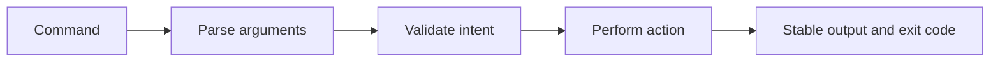

# CLI reference

---

## Reference · CLI

> **Reference purpose** — Use the CLI as a shared vocabulary for creation, verification, local operations, and release work.

Commands that are discoverable, scriptable, and consistent with CI.

### Reference model

### Contract summary

| Property | Definition | Review question |
| --- | --- | --- |
| Exit code | Automation signal | Zero means the contract passed. |
| Output | Human and machine readable | Do not require screen scraping. |
| Mutation | Explicit | Show what will change before acting. |

### Interpretation

A CLI becomes infrastructure when teams use it in automation; ambiguous output and hidden side effects then become operational debt.

> **Reference note**
>
> A good command leaves less ambiguity than the manual sequence it replaces.

## Related material

<Columns cols={3}>
  <Card title="Run release gates" icon="circle-check" href="/operations/release-checks" horizontal>Read the focused guide for this boundary.</Card>
  <Card title="Create a workspace" icon="download" href="/start/installation" horizontal>Read the focused guide for this boundary.</Card>
  <Card title="Understand outputs" icon="code" href="/reference/types" horizontal>Read the focused guide for this boundary.</Card>
</Columns>

## References

[1]: https://github.com/jeffersoncampos12p-dev/jeston "Jeston source repository"
[2]: https://www.npmjs.com/package/@hedronjs/jeston "Jeston package on npm"
[3]: https://nodejs.org/api/http.html "Node.js HTTP API"
[4]: https://developer.mozilla.org/en-US/docs/Web/API/AbortSignal "AbortSignal Web API"
[5]: https://react.dev/reference/react-dom/server "React server rendering APIs"
[6]: https://www.typescriptlang.org/docs/handbook/intro.html "TypeScript handbook"
