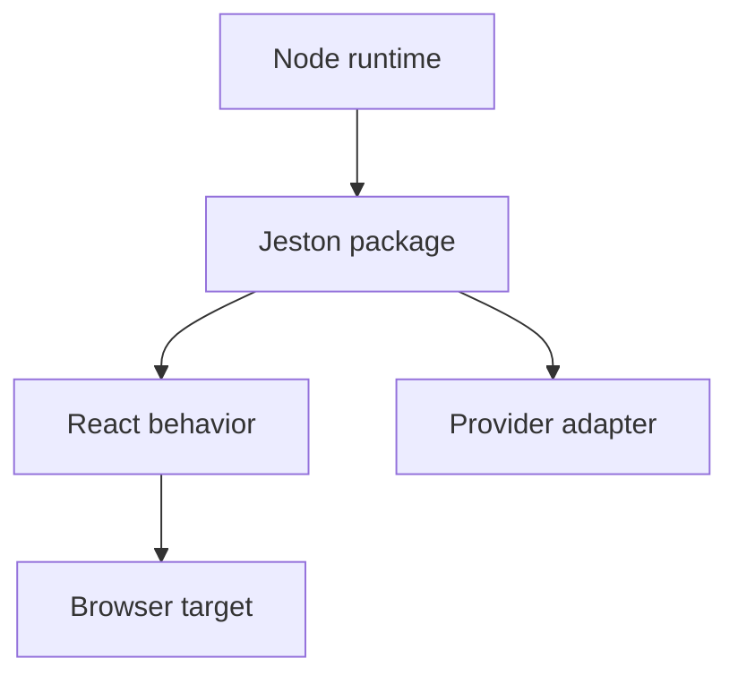

# Compatibility

---

## Reference · Compatibility

> **Reference purpose** — Make support claims precise enough that teams can plan upgrades and deployments without guesswork.

A compatibility envelope for Node, React, browsers, package exports, and known limitations.

### Reference model

### Contract summary

| Property | Definition | Review question |
| --- | --- | --- |
| Runtime | Node 20, 22, 24 | CI evidence required. |
| Package | Exports and types | Smoke import from a consumer. |
| Feature | Maturity label | Do not overpromise roadmap behavior. |

### Interpretation

Compatibility is a product feature: confidence depends on what is supported, tested, experimental, or explicitly out of scope.

> **Reference note**
>
> A compatibility statement is useful only when it can be checked.

## Related material

<Columns cols={3}>
  <Card title="Verify releases" icon="circle-check" href="/operations/release-checks" horizontal>Read the focused guide for this boundary.</Card>
  <Card title="Read stable types" icon="code" href="/reference/types" horizontal>Read the focused guide for this boundary.</Card>
  <Card title="Review RSC maturity" icon="atom" href="/core/react-server-components" horizontal>Read the focused guide for this boundary.</Card>
</Columns>

## References

[1]: https://github.com/jeffersoncampos12p-dev/jeston "Jeston source repository"
[2]: https://www.npmjs.com/package/@hedronjs/jeston "Jeston package on npm"
[3]: https://nodejs.org/api/http.html "Node.js HTTP API"
[4]: https://developer.mozilla.org/en-US/docs/Web/API/AbortSignal "AbortSignal Web API"
[5]: https://react.dev/reference/react-dom/server "React server rendering APIs"
[6]: https://www.typescriptlang.org/docs/handbook/intro.html "TypeScript handbook"
