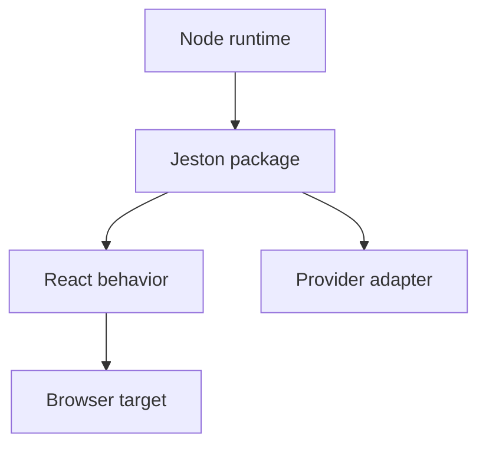

# Compatibility

<Accordion title="Detailed background for this page" icon="book-open">

Make support claims precise enough that teams can plan upgrades and deployments without guesswork.

**Expected outcome.** A compatibility envelope for Node, React, browsers, package exports, and known limitations.

**Why this boundary matters.** Compatibility is a product feature: confidence depends on what is supported, tested, experimental, or explicitly out of scope.

### Page-specific implementation notes

- **Declare the matrix:** List supported Node versions, package managers, React versions, and deployment assumptions.
- **Test the matrix:** Run typecheck, tests, build, and package smoke import on every supported runtime.
- **Label maturity:** Separate stable, experimental, roadmap, and unsupported behavior.
- **Plan migration:** Document breaking changes, deprecations, and rollback options.

### Page-specific failure questions

- **What is a breaking change?:** Any change that invalidates supported code, runtime, output, or operational expectations.
- **How should experimental APIs appear?:** With a visible label, limitation, and migration expectation.
- **What should a release prove?:** All matrix checks plus package contents and a consumer import.

</Accordion>

---

## Reference · Compatibility

> **Page focus** — Make support claims precise enough that teams can plan upgrades and deployments without guesswork.

### At a glance

| Scope | Practical result |
| --- | --- |
| **Focus** | Make support claims precise enough that teams can plan upgrades and deployments without guesswork. |
| **Deliverable** | A compatibility envelope for Node, React, browsers, package exports, and known limitations. |
| **Reason to care** | Compatibility is a product feature: confidence depends on what is supported, tested, experimental, or explicitly out of scope. |

<Info>
This page is intentionally focused on one boundary. Use the decision table and implementation sequence below as a working review sheet, not as a generic framework overview.
</Info>

### System view

<Info>
This guide has its own decision surface. Use the visual blocks for orientation, then open the detailed background above when you need the longer explanation.
</Info>

---

## Implementation sequence

<Steps titleSize="h3">
  <Step title="Declare the matrix" icon="crosshairs">
    List supported Node versions, package managers, React versions, and deployment assumptions.
  </Step>
  <Step title="Test the matrix" icon="layers-3">
    Run typecheck, tests, build, and package smoke import on every supported runtime.
  </Step>
  <Step title="Label maturity" icon="triangle-exclamation">
    Separate stable, experimental, roadmap, and unsupported behavior.
  </Step>
  <Step title="Plan migration" icon="flask-conical">
    Document breaking changes, deprecations, and rollback options.
  </Step>
</Steps>

## Choose a working mode

<Tabs>
  <Tab title="Supported" icon="book-open">
    Covered by CI and release expectations.
  </Tab>
  <Tab title="Experimental" icon="hammer">
    Usable with an explicit risk statement.
  </Tab>
  <Tab title="Unsupported" icon="chart-line">
    Do not infer behavior from a local success.
  </Tab>
</Tabs>

---

## Decision table

| Concern | Default posture | Review question |
| --- | --- | --- |
| Runtime | Node 20, 22, 24 | CI evidence required. |
| Package | Exports and types | Smoke import from a consumer. |
| Feature | Maturity label | Do not overpromise roadmap behavior. |

> **Design note**
>
> A compatibility statement is useful only when it can be checked.

<Note>
Pin the assumptions used by examples so documentation does not silently outrun the package.
</Note>

## Questions worth answering

<AccordionGroup>
  <Accordion title="What is a breaking change?" icon="circle-question">
    Any change that invalidates supported code, runtime, output, or operational expectations.
  </Accordion>
  <Accordion title="How should experimental APIs appear?" icon="binoculars">
    With a visible label, limitation, and migration expectation.
  </Accordion>
  <Accordion title="What should a release prove?" icon="arrow-right">
    All matrix checks plus package contents and a consumer import.
  </Accordion>
</AccordionGroup>

---

## Continue with a related guide

<Columns cols={3}>
  <Card title="Verify releases" icon="circle-check" href="/operations/release-checks" horizontal>Open the related guide when this page leaves a boundary unresolved.</Card>
  <Card title="Read stable types" icon="code" href="/reference/types" horizontal>Open the related guide when this page leaves a boundary unresolved.</Card>
  <Card title="Review RSC maturity" icon="atom" href="/core/react-server-components" horizontal>Open the related guide when this page leaves a boundary unresolved.</Card>
</Columns>

<Check>
This page is complete when its specific decision is documented, its failure behavior is tested, and its operational signal has an owner.
</Check>

## References

[1]: https://github.com/jeffersoncampos12p-dev/jeston "Jeston source repository"
[2]: https://www.npmjs.com/package/@hedronjs/jeston "Jeston package on npm"
[3]: https://nodejs.org/api/http.html "Node.js HTTP API"
[4]: https://developer.mozilla.org/en-US/docs/Web/API/AbortSignal "AbortSignal Web API"
[5]: https://react.dev/reference/react-dom/server "React server rendering APIs"
[6]: https://www.typescriptlang.org/docs/handbook/intro.html "TypeScript handbook"
