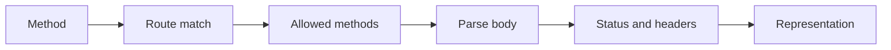

# HTTP contracts

<Accordion title="Detailed background for this page" icon="book-open" defaultOpen={true}>

Document the wire behavior that clients and intermediaries actually observe.

**Expected outcome.** Predictable methods, status codes, headers, body rules, OPTIONS, HEAD, and malformed input responses.

**Why this boundary matters.** HTTP details are compatibility surface; a small inconsistency can break caches, SDKs, proxies, or browser behavior.

### Page-specific implementation notes

- **Define method semantics:** State whether the operation is safe, idempotent, cacheable, or streaming.
- **Define errors:** Use stable status and body shapes for client, auth, dependency, and server failures.
- **Cover implicit methods:** Verify OPTIONS and Allow; keep HEAD bodyless while preserving metadata.
- **Test intermediaries:** Exercise cache headers, content type, length, and connection behavior.

### Page-specific failure questions

- **Why document Allow?:** Clients and tooling use it to discover method support.
- **What makes an error stable?:** Status, content type, category, and safe fields remain predictable.
- **When set cache headers?:** Only when freshness, authorization, and invalidation are understood.

</Accordion>

---

## Reference · HTTP contracts

> **Page focus** — Document the wire behavior that clients and intermediaries actually observe.

<Columns cols={2}>
  <Card title="What you will leave with" icon="globe" type="check">
    Predictable methods, status codes, headers, body rules, OPTIONS, HEAD, and malformed input responses.
  </Card>

  <Card title="Why this deserves its own page" icon="circle-question" type="note">
    HTTP details are compatibility surface; a small inconsistency can break caches, SDKs, proxies, or browser behavior.
  </Card>
</Columns>

### System view

<Info>
This guide has its own decision surface. Use the visual blocks for orientation, then open the detailed background above when you need the longer explanation.
</Info>

---

## Implementation sequence

<Steps titleSize="h3">
  <Step title="Define method semantics" icon="crosshairs">
    State whether the operation is safe, idempotent, cacheable, or streaming.
  </Step>
  <Step title="Define errors" icon="layers-3">
    Use stable status and body shapes for client, auth, dependency, and server failures.
  </Step>
  <Step title="Cover implicit methods" icon="triangle-exclamation">
    Verify OPTIONS and Allow; keep HEAD bodyless while preserving metadata.
  </Step>
  <Step title="Test intermediaries" icon="flask-conical">
    Exercise cache headers, content type, length, and connection behavior.
  </Step>
</Steps>

## Choose a working mode

<Tabs>
  <Tab title="JSON API" icon="book-open">
    Content type, malformed body, and error envelope.
  </Tab>
  <Tab title="Browser page" icon="hammer">
    HTML, redirects, cookies, and cache behavior.
  </Tab>
  <Tab title="Stream" icon="chart-line">
    Event framing, heartbeat, disconnect, and terminal semantics.
  </Tab>
</Tabs>

---

## Decision table

| Concern | Default posture | Review question |
| --- | --- | --- |
| OPTIONS | Capability discovery | Return allowed methods. |
| HEAD | Metadata without body | Mirror GET headers where appropriate. |
| 400 | Malformed request | Reject before side effects. |

> **Design note**
>
> HTTP correctness is part of the framework API, even when the application code is only a few lines.

<Note>
Do not make clients reverse-engineer status codes from successful examples alone.
</Note>

## Questions worth answering

<AccordionGroup>
  <Accordion title="Why document Allow?" icon="circle-question">
    Clients and tooling use it to discover method support.
  </Accordion>
  <Accordion title="What makes an error stable?" icon="binoculars">
    Status, content type, category, and safe fields remain predictable.
  </Accordion>
  <Accordion title="When set cache headers?" icon="arrow-right">
    Only when freshness, authorization, and invalidation are understood.
  </Accordion>
</AccordionGroup>

---

## Continue with a related guide

<Columns cols={3}>
  <Card title="Implement contracts" icon="brackets-curly" href="/core/api-routes" horizontal>Open the related guide when this page leaves a boundary unresolved.</Card>
  <Card title="Resolve paths" icon="route" href="/core/routing" horizontal>Open the related guide when this page leaves a boundary unresolved.</Card>
  <Card title="Secure responses" icon="shield-halved" href="/platform/security" horizontal>Open the related guide when this page leaves a boundary unresolved.</Card>
</Columns>

<Check>
This page is complete when its specific decision is documented, its failure behavior is tested, and its operational signal has an owner.
</Check>

## References

[1]: https://github.com/jeffersoncampos12p-dev/jeston "Jeston source repository"
[2]: https://www.npmjs.com/package/@hedronjs/jeston "Jeston package on npm"
[3]: https://nodejs.org/api/http.html "Node.js HTTP API"
[4]: https://developer.mozilla.org/en-US/docs/Web/API/AbortSignal "AbortSignal Web API"
[5]: https://react.dev/reference/react-dom/server "React server rendering APIs"
[6]: https://www.typescriptlang.org/docs/handbook/intro.html "TypeScript handbook"
