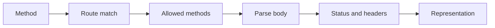

# HTTP contracts

---

## Reference · HTTP contracts

> **Reference purpose** — Document the wire behavior that clients and intermediaries actually observe.

Predictable methods, status codes, headers, body rules, OPTIONS, HEAD, and malformed input responses.

### Key concepts

<Columns cols={3}>
  <Card title="OPTIONS" icon="sparkles">
    Capability discovery
  </Card>
  <Card title="HEAD" icon="shield-check">
    Metadata without body
  </Card>
  <Card title="400" icon="gauge-high">
    Malformed request
  </Card>
</Columns>

### Reference model

### Contract summary

| Property | Definition | Review question |
| --- | --- | --- |
| OPTIONS | Capability discovery | Return allowed methods. |
| HEAD | Metadata without body | Mirror GET headers where appropriate. |
| 400 | Malformed request | Reject before side effects. |

### Interpretation

HTTP details are compatibility surface; a small inconsistency can break caches, SDKs, proxies, or browser behavior.

> **Reference note**
>
> HTTP correctness is part of the framework API, even when the application code is only a few lines.

### Implementation notes

| Engineering move | Guidance |
| --- | --- |
| **Define method semantics** | State whether the operation is safe, idempotent, cacheable, or streaming. |
| **Define errors** | Use stable status and body shapes for client, auth, dependency, and server failures. |
| **Cover implicit methods** | Verify OPTIONS and Allow; keep HEAD bodyless while preserving metadata. |
| **Test intermediaries** | Exercise cache headers, content type, length, and connection behavior. |

### Decision lens

| Mode | Practical emphasis |
| --- | --- |
| **JSON API** | Content type, malformed body, and error envelope. |
| **Browser page** | HTML, redirects, cookies, and cache behavior. |
| **Stream** | Event framing, heartbeat, disconnect, and terminal semantics. |

## Related topics

<Columns cols={3}>
- [brackets-curly · **Implement contracts**](/core/api-routes) — Read the focused guide for this boundary.
- [route · **Resolve paths**](/core/routing) — Read the focused guide for this boundary.
- [shield-halved · **Secure responses**](/platform/security) — Read the focused guide for this boundary.
</Columns>

### Why this matters

HTTP details are compatibility surface; a small inconsistency can break caches, SDKs, proxies, or browser behavior.

## References

[1]: https://github.com/kvantjs/ryvax.js "Ryvax source repository"
[2]: https://www.npmjs.com/package/@kvantjs/ryvax.js "Ryvax package on npm"
[3]: https://nodejs.org/api/http.html "Node.js HTTP API"
[4]: https://developer.mozilla.org/en-US/docs/Web/API/AbortSignal "AbortSignal Web API"
[5]: https://react.dev/reference/react-dom/server "React server rendering APIs"
[6]: https://www.typescriptlang.org/docs/handbook/intro.html "TypeScript handbook"
