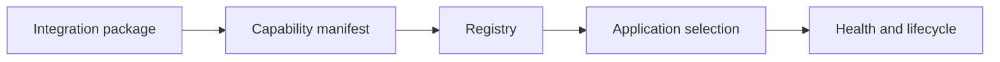

# Integrations and plugins

<Accordion title="Detailed background for this page" icon="book-open">

Grow the ecosystem through discoverable capabilities, lifecycle hooks, and compatibility metadata.

**Expected outcome.** Integrations that can be registered, searched, evaluated, upgraded, and removed safely.

**Why this boundary matters.** An ecosystem scales through governance and quality signals, not by accumulating an uncurated list of providers.

### Page-specific implementation notes

- **Describe the capability:** State supported operations, runtime, limits, and provider requirements.
- **Register metadata:** Make discovery useful without forcing every application to install every provider.
- **Define hooks:** Specify startup, shutdown, health, and configuration lifecycle.
- **Publish compatibility:** Version the integration contract and document support expectations.

### Page-specific failure questions

- **What belongs in a registry?:** Machine-readable capability, compatibility, ownership, and maturity metadata.
- **How should plugins fail?:** Startup should fail clearly for required plugins and degrade safely for optional ones.
- **What makes a provider professional?:** Docs, tests, security policy, versioning, and a responsible maintainer.

</Accordion>

---

## Reference · Integrations

> **Page focus** — Grow the ecosystem through discoverable capabilities, lifecycle hooks, and compatibility metadata.

### At a glance

| Scope | Practical result |
| --- | --- |
| **Focus** | Grow the ecosystem through discoverable capabilities, lifecycle hooks, and compatibility metadata. |
| **Deliverable** | Integrations that can be registered, searched, evaluated, upgraded, and removed safely. |
| **Reason to care** | An ecosystem scales through governance and quality signals, not by accumulating an uncurated list of providers. |

<Info>
This page is intentionally focused on one boundary. Use the decision table and implementation sequence below as a working review sheet, not as a generic framework overview.
</Info>

### System view

<Info>
This guide has its own decision surface. Use the visual blocks for orientation, then open the detailed background above when you need the longer explanation.
</Info>

---

## Implementation sequence

<Steps titleSize="h3">
  <Step title="Describe the capability" icon="crosshairs">
    State supported operations, runtime, limits, and provider requirements.
  </Step>
  <Step title="Register metadata" icon="layers-3">
    Make discovery useful without forcing every application to install every provider.
  </Step>
  <Step title="Define hooks" icon="triangle-exclamation">
    Specify startup, shutdown, health, and configuration lifecycle.
  </Step>
  <Step title="Publish compatibility" icon="flask-conical">
    Version the integration contract and document support expectations.
  </Step>
</Steps>

## Choose a working mode

<Tabs>
  <Tab title="Catalog" icon="book-open">
    Browse providers by capability and maturity.
  </Tab>
  <Tab title="Plugin" icon="hammer">
    Load lifecycle behavior with explicit ownership.
  </Tab>
  <Tab title="Internal" icon="chart-line">
    Register organization-specific adapters with private metadata.
  </Tab>
</Tabs>

---

## Decision table

| Concern | Default posture | Review question |
| --- | --- | --- |
| Metadata | What it does | Discoverability and comparison. |
| Lifecycle | When it runs | Safe startup and shutdown. |
| Maturity | How trusted | Adoption and risk signal. |

> **Design note**
>
> An ecosystem becomes powerful when integration quality is legible.

<Note>
Avoid claiming millions of integrations without a capability contract, testing policy, and maintenance owner.
</Note>

## Questions worth answering

<AccordionGroup>
  <Accordion title="What belongs in a registry?" icon="circle-question">
    Machine-readable capability, compatibility, ownership, and maturity metadata.
  </Accordion>
  <Accordion title="How should plugins fail?" icon="binoculars">
    Startup should fail clearly for required plugins and degrade safely for optional ones.
  </Accordion>
  <Accordion title="What makes a provider professional?" icon="arrow-right">
    Docs, tests, security policy, versioning, and a responsible maintainer.
  </Accordion>
</AccordionGroup>

---

## Continue with a related guide

<Columns cols={3}>
  <Card title="Design the seam" icon="puzzle-piece" href="/reference/adapters" horizontal>Open the related guide when this page leaves a boundary unresolved.</Card>
  <Card title="Govern the ecosystem" icon="sitemap" href="/operations/ecosystem" horizontal>Open the related guide when this page leaves a boundary unresolved.</Card>
  <Card title="Configure providers" icon="sliders" href="/core/configuration" horizontal>Open the related guide when this page leaves a boundary unresolved.</Card>
</Columns>

<Check>
This page is complete when its specific decision is documented, its failure behavior is tested, and its operational signal has an owner.
</Check>

## References

[1]: https://github.com/jeffersoncampos12p-dev/jeston "Jeston source repository"
[2]: https://www.npmjs.com/package/@hedronjs/jeston "Jeston package on npm"
[3]: https://nodejs.org/api/http.html "Node.js HTTP API"
[4]: https://developer.mozilla.org/en-US/docs/Web/API/AbortSignal "AbortSignal Web API"
[5]: https://react.dev/reference/react-dom/server "React server rendering APIs"
[6]: https://www.typescriptlang.org/docs/handbook/intro.html "TypeScript handbook"
