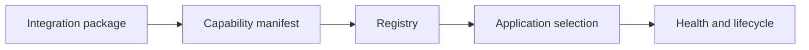

# Integrations and plugins

---

## Reference · Integrations

> **Reference purpose** — Grow the ecosystem through discoverable capabilities, lifecycle hooks, and compatibility metadata.

Integrations that can be registered, searched, evaluated, upgraded, and removed safely.

### Key concepts

<Columns cols={3}>
  <Card title="Metadata" icon="sparkles">
    What it does
  </Card>
  <Card title="Lifecycle" icon="shield-check">
    When it runs
  </Card>
  <Card title="Maturity" icon="gauge-high">
    How trusted
  </Card>
</Columns>

### Reference model

### Contract summary

| Property | Definition | Review question |
| --- | --- | --- |
| Metadata | What it does | Discoverability and comparison. |
| Lifecycle | When it runs | Safe startup and shutdown. |
| Maturity | How trusted | Adoption and risk signal. |

### Interpretation

An ecosystem scales through governance and quality signals, not by accumulating an uncurated list of providers.

> **Reference note**
>
> An ecosystem becomes powerful when integration quality is legible.

### Implementation notes

| Engineering move | Guidance |
| --- | --- |
| **Describe the capability** | State supported operations, runtime, limits, and provider requirements. |
| **Register metadata** | Make discovery useful without forcing every application to install every provider. |
| **Define hooks** | Specify startup, shutdown, health, and configuration lifecycle. |
| **Publish compatibility** | Version the integration contract and document support expectations. |

### Decision lens

| Mode | Practical emphasis |
| --- | --- |
| **Catalog** | Browse providers by capability and maturity. |
| **Plugin** | Load lifecycle behavior with explicit ownership. |
| **Internal** | Register organization-specific adapters with private metadata. |

## Related topics

<Columns cols={3}>
- [puzzle-piece · **Design the seam**](/reference/adapters) — Read the focused guide for this boundary.
- [sitemap · **Govern the ecosystem**](/operations/ecosystem) — Read the focused guide for this boundary.
- [sliders · **Configure providers**](/core/configuration) — Read the focused guide for this boundary.
</Columns>

### Why this matters

An ecosystem scales through governance and quality signals, not by accumulating an uncurated list of providers.

## References

[1]: https://github.com/kvantjs/ryvax.js "Ryvax source repository"
[2]: https://www.npmjs.com/package/@kvantjs/ryvax.js "Ryvax package on npm"
[3]: https://nodejs.org/api/http.html "Node.js HTTP API"
[4]: https://developer.mozilla.org/en-US/docs/Web/API/AbortSignal "AbortSignal Web API"
[5]: https://react.dev/reference/react-dom/server "React server rendering APIs"
[6]: https://www.typescriptlang.org/docs/handbook/intro.html "TypeScript handbook"
