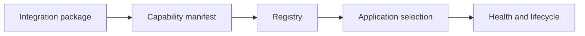

# Integrations and plugins

---

## Reference · Integrations

> **Reference purpose** — Grow the ecosystem through discoverable capabilities, lifecycle hooks, and compatibility metadata.

Integrations that can be registered, searched, evaluated, upgraded, and removed safely.

### Reference model

### Contract summary

| Property | Definition | Review question |
| --- | --- | --- |
| Metadata | What it does | Discoverability and comparison. |
| Lifecycle | When it runs | Safe startup and shutdown. |
| Maturity | How trusted | Adoption and risk signal. |

### Interpretation

An ecosystem scales through governance and quality signals, not by accumulating an uncurated list of providers.

> **Reference note**
>
> An ecosystem becomes powerful when integration quality is legible.

## Related material

<Columns cols={3}>
  <Card title="Design the seam" icon="puzzle-piece" href="/reference/adapters" horizontal>Read the focused guide for this boundary.</Card>
  <Card title="Govern the ecosystem" icon="sitemap" href="/operations/ecosystem" horizontal>Read the focused guide for this boundary.</Card>
  <Card title="Configure providers" icon="sliders" href="/core/configuration" horizontal>Read the focused guide for this boundary.</Card>
</Columns>

## References

[1]: https://github.com/jeffersoncampos12p-dev/jeston "Jeston source repository"
[2]: https://www.npmjs.com/package/@hedronjs/jeston "Jeston package on npm"
[3]: https://nodejs.org/api/http.html "Node.js HTTP API"
[4]: https://developer.mozilla.org/en-US/docs/Web/API/AbortSignal "AbortSignal Web API"
[5]: https://react.dev/reference/react-dom/server "React server rendering APIs"
[6]: https://www.typescriptlang.org/docs/handbook/intro.html "TypeScript handbook"
