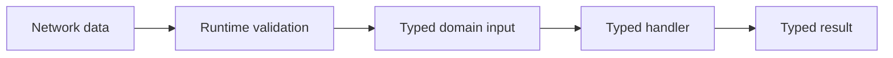

# Types reference

---

## Reference · Types

> **Reference purpose** — Use types to make lifecycle assumptions visible without pretending compile-time types validate network input.

A readable contract for contexts, handlers, responses, errors, and adapter capabilities.

### Reference model

### Contract summary

| Property | Definition | Review question |
| --- | --- | --- |
| Compile time | Developer feedback | Catches shape mismatch. |
| Runtime | Boundary safety | Catches hostile or malformed input. |
| Result | Caller contract | Makes success and failure explicit. |

### Interpretation

Types reduce accidental mismatch between layers, but boundary validation remains a runtime responsibility.

> **Reference note**
>
> A type is a promise made by code; validation is the evidence that the outside world kept it.

## Related material

<Columns cols={3}>
  <Card title="Pair types with HTTP" icon="globe" href="/reference/http-contracts" horizontal>Read the focused guide for this boundary.</Card>
  <Card title="Type capabilities" icon="puzzle-piece" href="/reference/adapters" horizontal>Read the focused guide for this boundary.</Card>
  <Card title="Apply handlers" icon="brackets-curly" href="/core/api-routes" horizontal>Read the focused guide for this boundary.</Card>
</Columns>

## References

[1]: https://github.com/jeffersoncampos12p-dev/jeston "Jeston source repository"
[2]: https://www.npmjs.com/package/@hedronjs/jeston "Jeston package on npm"
[3]: https://nodejs.org/api/http.html "Node.js HTTP API"
[4]: https://developer.mozilla.org/en-US/docs/Web/API/AbortSignal "AbortSignal Web API"
[5]: https://react.dev/reference/react-dom/server "React server rendering APIs"
[6]: https://www.typescriptlang.org/docs/handbook/intro.html "TypeScript handbook"
