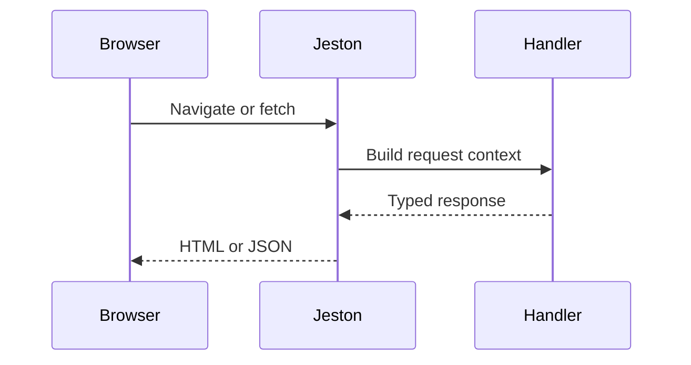

# Build your first Jeston application

<Accordion title="Detailed background for this page" icon="book-open" defaultOpen={true}>

Connect a page, a server handler, and a real request contract into one small vertical slice.

**Expected outcome.** A first application whose behavior can be inspected from browser to server response.

**Why this boundary matters.** A vertical slice exposes integration mistakes earlier than a collection of disconnected components.

### Page-specific implementation notes

- **Create the route:** Give the page or API endpoint a narrow responsibility.
- **Validate at the edge:** Reject malformed input before domain work or persistence.
- **Return an explicit result:** Choose status, headers, and body intentionally.
- **Exercise the failure path:** Test bad input, missing data, and a cancelled request.

### Page-specific failure questions

- **Why start vertically?:** It proves routing, rendering, handler execution, and feedback together.
- **When should data be added?:** After the route contract is stable; otherwise persistence obscures routing errors.
- **What is a useful smoke test?:** Request the page, call the endpoint, inspect status, and verify the rendered result.

</Accordion>

---

## Start · First application

> **Page focus** — Connect a page, a server handler, and a real request contract into one small vertical slice.

<Columns cols={2}>
  <Card title="What you will leave with" icon="wand-magic-sparkles" type="check">
    A first application whose behavior can be inspected from browser to server response.
  </Card>

  <Card title="Why this deserves its own page" icon="circle-question" type="note">
    A vertical slice exposes integration mistakes earlier than a collection of disconnected components.
  </Card>
</Columns>

### System view

<Info>
This guide has its own decision surface. Use the visual blocks for orientation, then open the detailed background above when you need the longer explanation.
</Info>

---

## Implementation sequence

<Steps titleSize="h3">
  <Step title="Create the route" icon="crosshairs">
    Give the page or API endpoint a narrow responsibility.
  </Step>
  <Step title="Validate at the edge" icon="layers-3">
    Reject malformed input before domain work or persistence.
  </Step>
  <Step title="Return an explicit result" icon="triangle-exclamation">
    Choose status, headers, and body intentionally.
  </Step>
  <Step title="Exercise the failure path" icon="flask-conical">
    Test bad input, missing data, and a cancelled request.
  </Step>
</Steps>

## Choose a working mode

<Tabs>
  <Tab title="Page" icon="book-open">
    Use SSR for initial content and clear loading boundaries.
  </Tab>
  <Tab title="API" icon="hammer">
    Keep method handling and response shapes explicit.
  </Tab>
  <Tab title="Test" icon="chart-line">
    Assert observable behavior rather than implementation details.
  </Tab>
</Tabs>

---

## Decision table

| Concern | Default posture | Review question |
| --- | --- | --- |
| Page | Initial HTML | Useful without waiting for client work. |
| API | Status and JSON | Stable for callers and tests. |
| Failure | Safe error body | Actionable without leaking internals. |

> **Design note**
>
> The first app should teach the request lifecycle, not hide it behind scaffolding.

<Note>
Keep the first slice small enough to understand in one sitting; complexity belongs in later platform pages.
</Note>

## Questions worth answering

<AccordionGroup>
  <Accordion title="Why start vertically?" icon="circle-question">
    It proves routing, rendering, handler execution, and feedback together.
  </Accordion>
  <Accordion title="When should data be added?" icon="binoculars">
    After the route contract is stable; otherwise persistence obscures routing errors.
  </Accordion>
  <Accordion title="What is a useful smoke test?" icon="arrow-right">
    Request the page, call the endpoint, inspect status, and verify the rendered result.
  </Accordion>
</AccordionGroup>

---

## Continue with a related guide

<Columns cols={3}>
  <Card title="Understand SSR" icon="server" href="/core/react-ssr" horizontal>Open the related guide when this page leaves a boundary unresolved.</Card>
  <Card title="Define API behavior" icon="brackets-curly" href="/core/api-routes" horizontal>Open the related guide when this page leaves a boundary unresolved.</Card>
  <Card title="Read HTTP contracts" icon="globe" href="/reference/http-contracts" horizontal>Open the related guide when this page leaves a boundary unresolved.</Card>
</Columns>

<Check>
This page is complete when its specific decision is documented, its failure behavior is tested, and its operational signal has an owner.
</Check>

## References

[1]: https://github.com/jeffersoncampos12p-dev/jeston "Jeston source repository"
[2]: https://www.npmjs.com/package/@hedronjs/jeston "Jeston package on npm"
[3]: https://nodejs.org/api/http.html "Node.js HTTP API"
[4]: https://developer.mozilla.org/en-US/docs/Web/API/AbortSignal "AbortSignal Web API"
[5]: https://react.dev/reference/react-dom/server "React server rendering APIs"
[6]: https://www.typescriptlang.org/docs/handbook/intro.html "TypeScript handbook"
