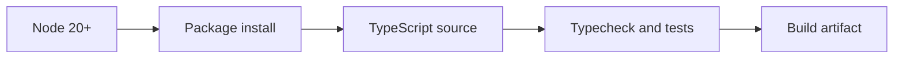

# Installation

<Accordion title="Detailed background for this page" icon="book-open" defaultOpen={true}>

Make a new Jeston workspace reproducible before writing application code.

**Expected outcome.** A clean install that another contributor can repeat on a supported Node runtime.

**Why this boundary matters.** Most early framework friction comes from drift in Node versions, package managers, environment variables, and generated artifacts.

### Page-specific implementation notes

- **Pin the runtime:** Choose the Node version used by CI and local development.
- **Install the package:** Keep the framework dependency explicit and inspect the lockfile.
- **Run the first checks:** Verify typecheck, tests, build, and package contents before customization.
- **Record assumptions:** Document environment variables, scripts, and the expected directory shape.

### Page-specific failure questions

- **What belongs in source control?:** Source, lockfile, scripts, configuration examples, and documentation; never credentials.
- **What should fail early?:** Unsupported Node versions, missing environment variables, and broken package exports.
- **What should the first commit prove?:** That a clean checkout can install, typecheck, test, build, and start.

</Accordion>

---

## Start · Installation

> **Page focus** — Make a new Jeston workspace reproducible before writing application code.

<Columns cols={2}>
  <Card title="What you will leave with" icon="download" type="check">
    A clean install that another contributor can repeat on a supported Node runtime.
  </Card>

  <Card title="Why this deserves its own page" icon="circle-question" type="note">
    Most early framework friction comes from drift in Node versions, package managers, environment variables, and generated artifacts.
  </Card>
</Columns>

### System view

<Info>
This guide has its own decision surface. Use the visual blocks for orientation, then open the detailed background above when you need the longer explanation.
</Info>

---

## Implementation sequence

<Steps titleSize="h3">
  <Step title="Pin the runtime" icon="crosshairs">
    Choose the Node version used by CI and local development.
  </Step>
  <Step title="Install the package" icon="layers-3">
    Keep the framework dependency explicit and inspect the lockfile.
  </Step>
  <Step title="Run the first checks" icon="triangle-exclamation">
    Verify typecheck, tests, build, and package contents before customization.
  </Step>
  <Step title="Record assumptions" icon="flask-conical">
    Document environment variables, scripts, and the expected directory shape.
  </Step>
</Steps>

## Choose a working mode

<Tabs>
  <Tab title="npm" icon="book-open">
    Use the published package and commit the lockfile.
  </Tab>
  <Tab title="CI" icon="hammer">
    Run the same checks on every supported Node version.
  </Tab>
  <Tab title="Restricted network" icon="chart-line">
    Cache dependencies and fail with an actionable message.
  </Tab>
</Tabs>

---

## Decision table

| Concern | Default posture | Review question |
| --- | --- | --- |
| Runtime | Node 20 or newer | Match the repository support matrix. |
| Verification | typecheck, test, build | Do this before adding providers. |
| Reproducibility | lockfile and scripts | A new clone should behave like the original. |

> **Design note**
>
> A fast first request is less valuable than a repeatable first request.

<Note>
Do not add Vite, Express, or a second application runtime to the Jeston setup.
</Note>

## Questions worth answering

<AccordionGroup>
  <Accordion title="What belongs in source control?" icon="circle-question">
    Source, lockfile, scripts, configuration examples, and documentation; never credentials.
  </Accordion>
  <Accordion title="What should fail early?" icon="binoculars">
    Unsupported Node versions, missing environment variables, and broken package exports.
  </Accordion>
  <Accordion title="What should the first commit prove?" icon="arrow-right">
    That a clean checkout can install, typecheck, test, build, and start.
  </Accordion>
</AccordionGroup>

---

## Continue with a related guide

<Columns cols={3}>
  <Card title="Build the first app" icon="rocket" href="/start/first-app" horizontal>Open the related guide when this page leaves a boundary unresolved.</Card>
  <Card title="Inspect the CLI" icon="terminal" href="/reference/cli" horizontal>Open the related guide when this page leaves a boundary unresolved.</Card>
  <Card title="Prepare release checks" icon="circle-check" href="/operations/release-checks" horizontal>Open the related guide when this page leaves a boundary unresolved.</Card>
</Columns>

<Check>
This page is complete when its specific decision is documented, its failure behavior is tested, and its operational signal has an owner.
</Check>

## References

[1]: https://github.com/jeffersoncampos12p-dev/jeston "Jeston source repository"
[2]: https://www.npmjs.com/package/@hedronjs/jeston "Jeston package on npm"
[3]: https://nodejs.org/api/http.html "Node.js HTTP API"
[4]: https://developer.mozilla.org/en-US/docs/Web/API/AbortSignal "AbortSignal Web API"
[5]: https://react.dev/reference/react-dom/server "React server rendering APIs"
[6]: https://www.typescriptlang.org/docs/handbook/intro.html "TypeScript handbook"
