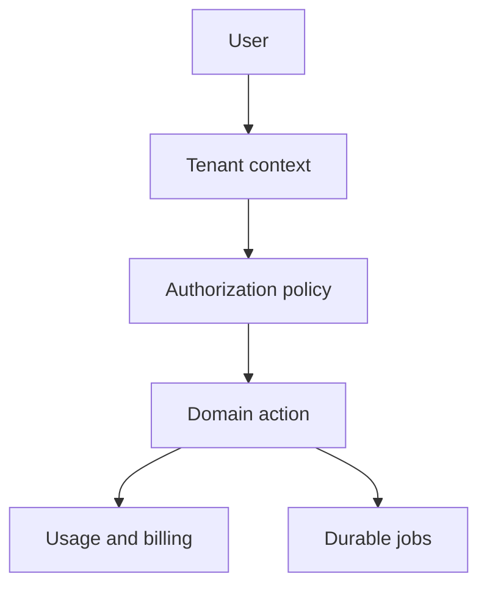

# SaaS starter

<Accordion title="Detailed background for this page" icon="book-open" defaultOpen={true}>

Model a multi-user product as cooperating boundaries instead of one oversized route handler.

**Expected outcome.** A SaaS foundation with tenant context, identity, billing seams, jobs, and operational ownership.

**Why this boundary matters.** SaaS complexity is mostly coordination: who owns data, who may act, what can be retried, and how usage is measured.

### Page-specific implementation notes

- **Define tenancy:** Choose how tenant identity enters the request and how it is enforced.
- **Separate identity from authorization:** A valid session does not automatically grant access to every tenant resource.
- **Move slow work to jobs:** Email, exports, indexing, and model tasks need durable status.
- **Instrument usage:** Record the signals required for limits, billing, and support.

### Page-specific failure questions

- **Where should tenant scope live?:** At the request boundary and again in persistence queries; never rely on a UI filter.
- **What needs idempotency?:** Billing events, invitations, provisioning, and webhook-driven updates.
- **What becomes a job?:** Work that may outlive the request or needs retry and durable status.

</Accordion>

---

## Start · SaaS starter

> **Page focus** — Model a multi-user product as cooperating boundaries instead of one oversized route handler.

<Columns cols={2}>
  <Card title="What you will leave with" icon="building" type="check">
    A SaaS foundation with tenant context, identity, billing seams, jobs, and operational ownership.
  </Card>

  <Card title="Why this deserves its own page" icon="circle-question" type="note">
    SaaS complexity is mostly coordination: who owns data, who may act, what can be retried, and how usage is measured.
  </Card>
</Columns>

### System view

<Info>
This guide has its own decision surface. Use the visual blocks for orientation, then open the detailed background above when you need the longer explanation.
</Info>

---

## Implementation sequence

<Steps titleSize="h3">
  <Step title="Define tenancy" icon="crosshairs">
    Choose how tenant identity enters the request and how it is enforced.
  </Step>
  <Step title="Separate identity from authorization" icon="layers-3">
    A valid session does not automatically grant access to every tenant resource.
  </Step>
  <Step title="Move slow work to jobs" icon="triangle-exclamation">
    Email, exports, indexing, and model tasks need durable status.
  </Step>
  <Step title="Instrument usage" icon="flask-conical">
    Record the signals required for limits, billing, and support.
  </Step>
</Steps>

## Choose a working mode

<Tabs>
  <Tab title="Single tenant" icon="book-open">
    Optimize for clarity and simple local development.
  </Tab>
  <Tab title="Multi tenant" icon="hammer">
    Make tenant scope explicit in every query and cache key.
  </Tab>
  <Tab title="Enterprise" icon="chart-line">
    Add auditability, stronger isolation, and operational runbooks.
  </Tab>
</Tabs>

---

## Decision table

| Concern | Default posture | Review question |
| --- | --- | --- |
| Identity | Who is the actor? | Session and provider boundary. |
| Scope | Which tenant? | Request context and query predicates. |
| Usage | What was consumed? | Event or metering record. |

> **Design note**
>
> A SaaS starter is a set of explicit ownership decisions, not a dashboard template.

<Note>
Billing and authorization are consequential domains. Keep their policies in application code and test them independently.
</Note>

## Questions worth answering

<AccordionGroup>
  <Accordion title="Where should tenant scope live?" icon="circle-question">
    At the request boundary and again in persistence queries; never rely on a UI filter.
  </Accordion>
  <Accordion title="What needs idempotency?" icon="binoculars">
    Billing events, invitations, provisioning, and webhook-driven updates.
  </Accordion>
  <Accordion title="What becomes a job?" icon="arrow-right">
    Work that may outlive the request or needs retry and durable status.
  </Accordion>
</AccordionGroup>

---

## Continue with a related guide

<Columns cols={3}>
  <Card title="Secure identity" icon="user-lock" href="/platform/auth" horizontal>Open the related guide when this page leaves a boundary unresolved.</Card>
  <Card title="Scope data access" icon="database" href="/platform/sql" horizontal>Open the related guide when this page leaves a boundary unresolved.</Card>
  <Card title="Operate the SaaS" icon="server-stack" href="/operations/production" horizontal>Open the related guide when this page leaves a boundary unresolved.</Card>
</Columns>

<Check>
This page is complete when its specific decision is documented, its failure behavior is tested, and its operational signal has an owner.
</Check>

## References

[1]: https://github.com/jeffersoncampos12p-dev/jeston "Jeston source repository"
[2]: https://www.npmjs.com/package/@hedronjs/jeston "Jeston package on npm"
[3]: https://nodejs.org/api/http.html "Node.js HTTP API"
[4]: https://developer.mozilla.org/en-US/docs/Web/API/AbortSignal "AbortSignal Web API"
[5]: https://react.dev/reference/react-dom/server "React server rendering APIs"
[6]: https://www.typescriptlang.org/docs/handbook/intro.html "TypeScript handbook"
